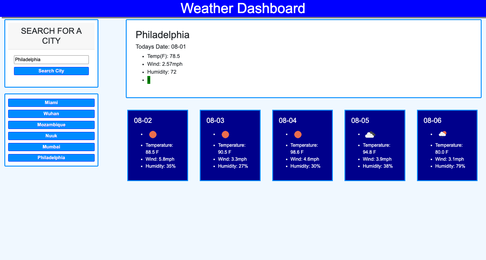

# weather_dashboard

## Description
I was tasked with building a weather dashboard displaying the current weather and a five day forecast for any city the user chooses to search for. The returned response was to include the temperature, wind, humidity, and UV index, and the users recent search history was to be saved. The application has been built and deployed succesfully with full functionality. 

The app functions via listening for two events, searching for a city or clicking a button containing recent search history. Searching for a city returns a new search history button under the search bar, assuming the user has a large enough screen for it to properly display. When an event is fired an AJAX response is called for openweatherweathers flagship API. This response fills out the temp, wind, and humidty of todays date, while the latitude and longitude is used to send another AJAX request for openweathers onecall API. The onecall response is used to fill out the UV index and timezone, and color the UV index based on the UV index scale. The five day forecast is also called using a third API, openweathers forecast API. 

## Installation

1. Thanks to the World Wide Web you can view this document from any net-connected device using the following HyperText Transfer Protocol Secure Address: https://deviousdoge.github.io/weather_dashboard/

2. Source code can be viewed by cloning the repository found here to your local machine using git bash (PC) or HomeBrew (Mac): https://github.com/DeviousDoge/weather_dashboard

3. Document is structured with index.html and styled with reset.css and style.css. Document is scripted with script.js.

## Usage

